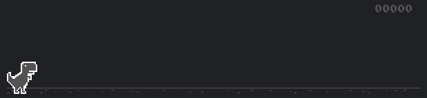

[](https://litetex.github.io/t-rex-runner/)
[](https://hub.docker.com/r/litetex/t-rex-runner/tags?name=latest)

## t-rex-runner 🦖

This is an updated version of the t-rex-runner game, originally extracted by [wayou/t-rex-runner](https://github.com/wayou/t-rex-runner)

[source](https://cs.chromium.org/chromium/src/components/neterror/resources/offline.js) from chromium

You can find a online version at https://litetex.github.io/t-rex-runner/



## How to run it

Unfortunately it's only possible to run the code on a webserver.<br/>
You can find the exact reason [here](https://stackoverflow.com/questions/48753691/cannot-access-cssrules-from-local-css-file-in-chrome-64)

A simple predefined image exists at [DockerHub](https://hub.docker.com/r/litetex/t-rex-runner)

However here is a quick setup if you wan't to build it yourself using docker
* Get Docker
* Build it with
```SHELL
docker build -t my-trex-runner-demo .
```
* Start it with 
```SHELL
docker run --rm -it --name trex-runner-demo -p 8080:80 my-trex-runner-demo
```
* Open http://localhost:8080
* Shutdown the server/container with ``Ctrl + C`` or by running
```SHELL
docker rm -f trex-runner-demo
```

All in one:
```SHELL
docker build -t my-trex-runner-demo . && docker run --rm -it --name trex-runner-demo -p 8080:80 my-trex-runner-demo
```

## How to extract the required code
* Clone the [chromium repo](https://chromium.googlesource.com/chromium/src)<br/>
  * Chromium is a really large repo (as of now it has nearly 1 million Commits and the default branch with only the latest commits alone consumes 4GB of disk memory) so you should clone it only optimized: 
  ```
  git clone --depth 1 --branch master https://chromium.googlesource.com/chromium/src
  ```
* Check the dependencies of the [neterror component html page](https://source.chromium.org/chromium/chromium/src/+/master:components/neterror/resources/neterror.html)
  * More details can also be found in [this build file](https://source.chromium.org/chromium/chromium/src/+/master:components/neterror/resources/BUILD.gn)
* Currently the components ``components/neterror`` and ``components/security_interstitials`` are required, so let's extract them
* Extract those dependencies (copy the directories) into a new directory

## Migration
* Clean not required stuff from the html file, e.g. i18n or not used parts of the div
* The sounds have to be served encoded in Base64, so encode them and add them directly
* Remove the complicated ``neterror.js`` and replace it at the end of the body with a simple ``<script>new Runner('.interstitial-wrapper');</script>``
* Clean up ``offline.js`` by removing external dependencies or merging them into the file<br> e.g. ``loadTimeData`` is only used to determine if [the game should be disabled](https://source.chromium.org/chromium/chromium/src/+/c117d8c5553c5143dd8723575a5d6113e8169490:components/neterror/resources/offline.js;l=243-267), which we totally don't need
* The JS-Constant ``<script>const HIDDEN_CLASS = 'hidden';</script>`` is required
* Simplify the stylesheets into a single one and clean up not required stuff
* Remove unnecessary images
